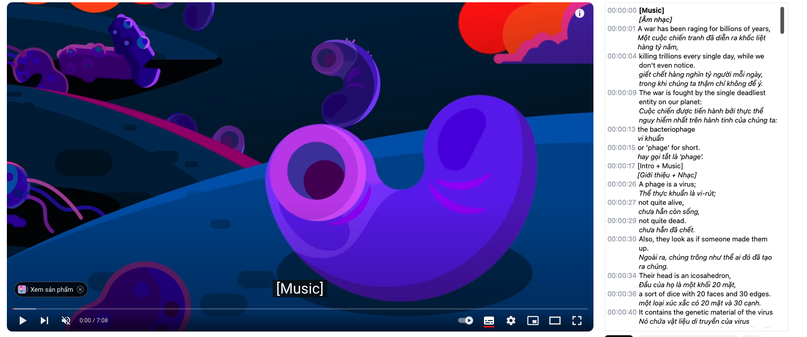
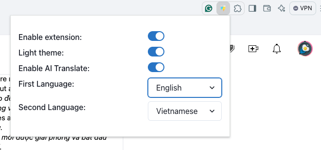

# Bilingual
Bilingual is a browser extension that enhances your YouTube experience by adding a sidebar with dual-language subtitles, helping language learners improve their skills more effectively.

## Features
- Displays subtitles in two languages side by side for better comprehension.
- Allows to jump to a specific caption.
- Adds a scrollable subtitle list to easily view, read, and search through all captions in the video.
- Allows quick lookup of word meanings via Google, making learning more interactive and convenient.

# Why Bilingual?
Inspired by the Dual Caption extension, Bilingual goes a step further. It includes a complete subtitle list alongside the video, making it easier to navigate and review content in both languages. This feature is especially helpful for language learners who want to track the full context and quickly look up unfamiliar words.

# Getting Started

Download the extension from release, and load it with as unpacked extensions. [Guide](https://knowledge.workspace.google.com/kb/load-unpacked-extensions-000005962)

Update language

When enabling AI translate, the extension uses generated translated captions. If this option is disabled, the extension uses caption of from video in the selected language.

# Credits
This project is built using chrome-extension-boilerplate-react-vite. Special thanks to the developers who created and maintain this fantastic tool!

